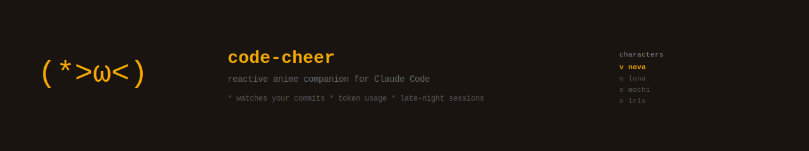

[](https://github.com/tonylt/code-cheer/actions/workflows/ci.yml)

[English](./README.md)

# code-cheer

<p align="center"></p>

**Claude Code 状态栏应援助手 —— 二次元角色陪你写代码，实时显示鼓励语和 token 用量。**

code-cheer **响应你的编程行为**，而不是被动摆设。它感知你今天的首次提交、里程碑推送、深夜编码、上下文窗口即将用完——并以角色专属的方式反应。

- Git 事件感知 — 首次提交、提交里程碑（5/10/20 次）、深夜提交、大 diff 等自动触发角色专属台词
- 4 个动漫角色 — Nova、Luna、Mochi、Iris，各具独特性格，随时用 `/cheer` 切换
- 实时状态栏 — 模型名、当前项目目录、token 用量、上下文进度条一行看清

---

## 效果预览

```
(=^･ω･^=) Mochi: 跑完这个就去休息… 才不是
sonnet-4-6 | code-cheer | 47k tokens | [████░░░░░░] 32%
```

每次 Claude 回复结束后，状态栏自动刷新：第一行角色台词，第二行显示模型、项目名、token 用量和上下文进度条。

---

## 环境要求

- **Node.js 18+**（检查：`node --version`）
- **npm**（随 Node.js 一起安装）
- **git**
- **Claude Code v2.1.80+**

---

## 安装

```bash
git clone https://github.com/tonylt/code-cheer.git
cd code-cheer
npm install
npm run setup
```

重启 Claude Code，状态栏立即生效。

> **从 code-pal 迁移？** 执行 `npm run setup` 会自动将配置从 `~/.claude/code-pal/` 迁移至 `~/.claude/code-cheer/`。

---

## 切换角色

```
/cheer          # 交互选择
/cheer nova     # 直接指定
/cheer luna
/cheer mochi
/cheer iris
```

---

## 配置

编辑 `~/.claude/code-cheer/config.json` 自定义行为：

```json
{
  "character": "nova",
  "language": "en"
}
```

| 字段 | 可选值 | 默认值 | 说明 |
|------|--------|--------|------|
| `character` | `nova`、`luna`、`mochi`、`iris` | `nova` | 当前角色 |
| `language` | `"zh"`、`"en"` | `"zh"` | 台词语言 — 中文或英文 |

每个角色同时拥有中文（`vocab/nova.json`）和英文（`vocab/nova.en.json`）台词文件。设置 `"language": "en"` 可将所有角色台词切换为英文。

---

## 角色一览

| 角色 | 表情符 | 风格 |
|------|--------|------|
| **Nova 星野** | `(*>ω<)` | 元气满满，运动系啦啦队 |
| **Luna 月野** | `(´• ω •\`)` | 温柔治愈，陪伴系 |
| **Mochi 年糕** | `(=^･ω･^=)` | 软萌奶凶，傲娇猫系 |
| **Iris 晴** | `(￣ω￣)` | 女王御姐，冷静挑衅 |

---

## 工作原理

```
Claude response ends (Stop hook)
        ↓
node dist/statusline.js --update
  → reads token stats from stats-cache.json
  → selects message by: usage tier > time slot > random
  → writes to ~/.claude/code-cheer/state.json
        ↓
Statusline polls node dist/statusline.js
  → reads state.json → renders to status bar
```

**台词选择优先级：**

| 优先级 | 触发条件 | 结果 |
|--------|----------|------|
| 1 | token 用量等级变化（正常 → 警告 → 紧急） | 告警台词 |
| 2 | 同一非正常等级 | 保持当前告警 |
| 3 | 每次 Claude 回复后 | 轮换 `post_tool` 台词 |
| 4 | 时间段变化（早晨/下午/傍晚/深夜） | 时段专属台词 |
| 5 | 兜底 | 随机，不重复 |

---

## 自定义台词

编辑角色的 JSON 文件即可添加自己的台词：

```bash
~/.claude/code-cheer/vocab/nova.json      # 中文（默认）
~/.claude/code-cheer/vocab/nova.en.json   # 英文
~/.claude/code-cheer/vocab/luna.json
~/.claude/code-cheer/vocab/luna.en.json
~/.claude/code-cheer/vocab/mochi.json
~/.claude/code-cheer/vocab/mochi.en.json
~/.claude/code-cheer/vocab/iris.json
~/.claude/code-cheer/vocab/iris.en.json
```

每个文件包含以下触发类别：`post_tool`（工具后）、`time`（时段：morning/afternoon/evening/midnight）、`usage`（用量告警：warning/critical）、`random`（随机兜底）。

---

## 卸载

```bash
npm run unsetup
```

删除所有文件并清理 `~/.claude/settings.json`。如果你之前配置了其他 statusLine，卸载时会自动恢复。

---

## 文件结构

```
code-cheer/
├── src/
│   ├── statusline.ts   # 状态栏入口
│   └── core/
│       ├── character.ts  # vocab 加载
│       ├── trigger.ts    # 台词选择逻辑
│       ├── display.ts    # 渲染输出
│       └── gitContext.ts # git 上下文
├── scripts/
│   ├── install.js      # npm run setup
│   └── uninstall.js    # npm run unsetup
├── dist/
│   └── statusline.js   # esbuild 打包产物（gitignored）
├── vocab/
│   ├── nova.json        # 中文台词
│   ├── nova.en.json     # 英文台词
│   ├── luna.json
│   ├── luna.en.json
│   ├── mochi.json
│   ├── mochi.en.json
│   ├── iris.json
│   └── iris.en.json
├── commands/
│   └── cheer.md        # /cheer 斜杠命令
└── tests/              # Jest 测试套件（167 个测试）
```

---

## 测试

```bash
npm test
```

167 个测试，6 个套件（character、display、gitContext、trigger、statusline、install）。

---

## 贡献

欢迎提 Pull Request！最简单的贡献方式是新增角色或台词——不需要写 TypeScript，只需一个 JSON 文件（加一行配置）。详见 [CONTRIBUTING.md](./CONTRIBUTING.md)。

一些想法：
- 新角色
- 新台词
- 多语言台词包
- Bug 修复

---

## 常见问题

**状态栏没有显示？**
确认 `npm run setup` 运行无报错，然后重启 Claude Code。验证配置是否写入：
`cat ~/.claude/settings.json | grep statusLine`

**找不到 `node` 命令或版本不符？**
code-cheer 需要 Node.js 18+。运行 `node --version` 确认版本。可通过 [nodejs.org](https://nodejs.org) 或 nvm/fnm 安装。

**`npm run setup` 报错？**
在仓库根目录下运行。确认 `~/.claude/` 目录存在（Claude Code 首次运行时自动创建）。

**Stop hook 未触发？**
确认 hook 已注册：`cat ~/.claude/settings.json | grep -A5 Stop`。如缺失，重新运行 `npm run setup`，然后重启 Claude Code。

**Claude Code 版本不符？**
code-cheer 需要 Claude Code v2.1.80 或更高版本。检查当前版本并按需更新。

**其他工具已占用 statusLine？**
code-cheer 需要独占 statusLine 配置才能工作。安装时会自动备份现有配置到 `~/.claude/code-cheer/statusline-backup.json`，卸载时恢复。如需切换不同工具，请先卸载当前工具再安装另一个。


---

## 许可证

[MIT](./LICENSE)

---

## 致谢

本项目 fork 自并受启发于 [@alexfly123lee-creator](https://github.com/alexfly123lee-creator) 的 [Claude-Code-Cheer](https://github.com/alexfly123lee-creator/Claude-Code-Cheer)。感谢原创灵感与基础实现。
